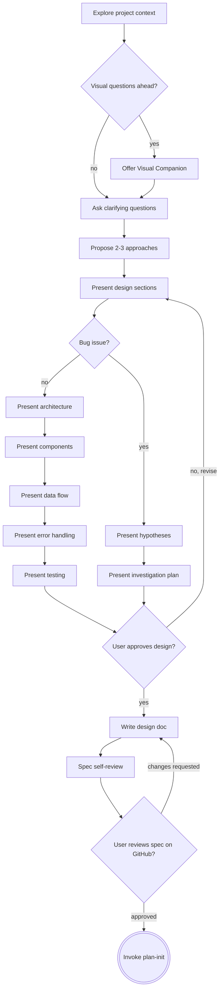

# Brainstorming Ideas Into Designs

`$ARGUMENTS` is a GitHub issue number or URL. If empty, try to infer the issue
number from the current branch name — if the branch name starts with digits
(e.g. `42-some-feature`), use that number. If no issue number can be found, ask
the user to provide one before continuing. **This skill requires a GitHub issue
— it does not run without one.**

Help turn ideas into fully formed designs and specs through natural
collaborative dialogue, grounded in the GitHub issue that describes what to
build.

Start by understanding the issue and the current project context, then ask
questions one at a time to refine the idea. Once you understand what you're
building, present the design and get user approval.

<HARD-GATE>
Do NOT invoke any implementation skill, write any code, scaffold any project, or take any implementation action until you have presented a design and the user has approved it. This applies to EVERY project regardless of perceived simplicity.
</HARD-GATE>

## Anti-Pattern: "This Is Too Simple To Need A Design"

Every project goes through this process. A todo list, a single-function
utility, a config change — all of them. "Simple" projects are where unexamined
assumptions cause the most wasted work. The design can be short (a few
sentences for truly simple projects), but you MUST present it and get approval.

## Checklist

You MUST create a task for each of these items, including subitems, and
complete them in order:

1. **Fetch issue and explore context** — issue details, type template, codebase
2. **Offer visual companion** — if visual questions ahead; own message only
3. **Ask clarifying questions** — one at a time
4. **Propose 2-3 approaches** — with trade-offs and recommendation
5. **Present design** — section by section, get approval as you go
   - For feature / enhancement / task / pitch issues:
     - 5.1 **Present architecture** — get approval; if N/A, complete and note
       why
     - 5.2 **Present components** — get approval; if N/A, complete and note why
     - 5.3 **Present data flow** — get approval; if N/A, complete and note why
     - 5.4 **Present error handling** — get approval; if N/A, complete and note
       why
     - 5.5 **Present testing** — get approval; if N/A, complete and note why
   - For bug issues:
     - 5.a **Present hypotheses** — 2-3 root cause candidates; get approval; if
       N/A, note why
     - 5.b **Present investigation plan** — where to look, what to instrument;
       get approval
6. **Write design doc** — update issue title and body, filling all template
   sections
7. **Spec self-review** — fix placeholders, contradictions, ambiguity inline
8. **User reviews spec on GitHub** — post comment with link, suggest `/fix` for
   feedback
9. **Invoke plan-init** — create implementation plan

## Process Flow



**The terminal state is invoking plan-init.** Do NOT invoke plan-execute or any
other implementation skill. The ONLY skill you invoke after brainstorming is
plan-init.

## The Process

**Understanding the idea:**

- Fetch the issue (title, body, issue type) and load the matching type template
  from `references/templates/`. The issue title and body are the primary
  description of what is being built — they set the starting scope and intent
  for everything that follows. After fetching, apply the `in progress` label:

  ```bash
  remote_url=$(git remote get-url origin)
  remote_url=${remote_url%.git}
  owner_repo=$(echo "$remote_url" | sed 's|\.git$||; s|.*[:/]\([^/]*/[^/]*\)$|\1|')
  TOKEN="${GITHUB_TOKEN:-${GH_TOKEN:-$(gh auth token 2>/dev/null || true)}}"
  curl -X POST \
    -H "Authorization: Bearer $TOKEN" \
    -H "Accept: application/vnd.github+json" \
    "https://api.github.com/repos/$owner_repo/issues/{issue-number}/labels" \
    -d '{"labels":["in progress"]}' | jq .
  ```

  If the label call fails, warn the user and continue — label management is
  non-blocking.

- Check out the current project state (files, docs, recent commits)
- Before asking detailed questions, assess scope: if the request describes
  multiple independent subsystems (e.g., "build a platform with chat, file
  storage, billing, and analytics"), flag this immediately. Don't spend
  questions refining details of a project that needs to be decomposed first.
- If the project is too large for a single spec, help the user decompose into
  sub-projects: what are the independent pieces, how do they relate, what order
  should they be built? Then brainstorm the first sub-project through the
  normal design flow. Each sub-project gets its own spec → plan →
  implementation cycle.
- For appropriately-scoped projects, ask questions one at a time to refine the
  idea
- Prefer multiple choice questions when possible, but open-ended is fine too
- Only one question per message - if a topic needs more exploration, break it
  into multiple questions
- Focus on understanding: purpose, constraints, success criteria

**Refining bugs:**

Bug issues follow a different flow from feature/task/enhancement issues. The
filer often doesn't know the fix — they know the symptom. Refinement here is
investigation-first:

- Ask questions to narrow down root cause: when did it start, how consistently
  does it reproduce, any recent changes nearby?
- Form 2-3 hypotheses about what could cause the observed behavior
- Propose an **Investigation Plan**: where to look first, what to instrument or
  log, how to confirm or rule out each hypothesis
- Only once root cause is understood should a fix approach be proposed
- Fill **Investigation Plan** (not Proposal) with the chosen debugging strategy
  and hypotheses; fill **Alternatives** with other investigation strategies
  that were considered but set aside — they serve as fallback paths if the
  primary plan doesn't yield results

**Exploring approaches:**

- Propose 2-3 different approaches with trade-offs
- Present options conversationally with your recommendation and reasoning
- Lead with your recommended option and explain why

**Presenting the design:**

- Once you believe you understand what you're building, present the design
- Scale each section to its complexity: a few sentences if straightforward, up
  to 200-300 words if nuanced
- Ask after each section whether it looks right so far
- Cover: architecture, components, data flow, error handling, testing
- Be ready to go back and clarify if something doesn't make sense

**Design for isolation and clarity:**

- Break the system into smaller units that each have one clear purpose,
  communicate through well-defined interfaces, and can be understood and tested
  independently
- For each unit, you should be able to answer: what does it do, how do you use
  it, and what does it depend on?
- Can someone understand what a unit does without reading its internals? Can
  you change the internals without breaking consumers? If not, the boundaries
  need work.
- Smaller, well-bounded units are also easier for you to work with - you reason
  better about code you can hold in context at once, and your edits are more
  reliable when files are focused. When a file grows large, that's often a
  signal that it's doing too much.

**Working in existing codebases:**

- Explore the current structure before proposing changes. Follow existing
  patterns.
- Where existing code has problems that affect the work (e.g., a file that's
  grown too large, unclear boundaries, tangled responsibilities), include
  targeted improvements as part of the design - the way a good developer
  improves code they're working in.
- Don't propose unrelated refactoring. Stay focused on what serves the current
  goal.

## After the Design

**Documentation:**

- Use elements-of-style:writing-clearly-and-concisely skill if available
- Post the spec as the updated issue body on GitHub, filling in all sections of
  the issue type template. The issue body is the canonical, living spec.
- Also update the issue title to reflect the refined purpose. A good title is
  specific (captures what was actually discovered in refinement, not the
  original placeholder), concise (readable in the issue list without
  truncation), and written as a short noun phrase or imperative verb phrase.
- The **Proposal** section (field `id: solution` called **The Solution** in the
  Pitch template, and **Investigation Plan** in the Bug template) must contain
  the full spec detail from the brainstorming session. Structure it freely —
  use headings, paragraphs, or lists as the content warrants. Cover
  architecture, components, data flow, error handling, and testing where
  relevant, but do not impose headings that don't apply to the scope of the
  issue. For bugs, this section describes the investigation strategy and
  hypotheses, not a fix proposal.
- The **Alternatives** section must be filled with every design decision where
  multiple options were considered. For each, include a concise summary of each
  option and its tradeoffs, and note which was chosen and why. Use this format:

  > **{Decision point}:**
  >
  > - Option A: ... (tradeoff)
  > - Option B: ... (tradeoff)
  > - ✅ Chosen: Option A — because ...

**Spec Self-Review:** After writing the spec document, look at it with fresh
eyes:

1. **Placeholder scan:** Any "TBD", "TODO", incomplete sections, or vague
   requirements? Fix them.
2. **Internal consistency:** Do any sections contradict each other? Does the
   architecture match the feature descriptions?
3. **Scope check:** Is this focused enough for a single implementation plan, or
   does it need decomposition?
4. **Ambiguity check:** Could any requirement be interpreted two different
   ways? If so, pick one and make it explicit.

Fix any issues inline. No need to re-review — just fix and move on.

**User Review Gate:** After the spec review loop passes, post a comment on the
issue linking to the updated issue body, then ask the user to review it there
before proceeding:

> "Updated the title to `{new title}` and posted the spec to the issue body.
> Please review at <issue-url> and let me know if you want any changes before
> we create the implementation plan. If you leave comments on the issue, run
> `/fix` to address them."

Remove `in progress` and apply `to review` to signal the handoff:

```bash
remote_url=$(git remote get-url origin)
remote_url=${remote_url%.git}
owner_repo=$(echo "$remote_url" | sed 's|\.git$||; s|.*[:/]\([^/]*/[^/]*\)$|\1|')
TOKEN="${GITHUB_TOKEN:-${GH_TOKEN:-$(gh auth token 2>/dev/null || true)}}"
curl -X DELETE \
  -H "Authorization: Bearer $TOKEN" \
  -H "Accept: application/vnd.github+json" \
  "https://api.github.com/repos/$owner_repo/issues/{issue-number}/labels/in%20progress" | jq .
curl -X POST \
  -H "Authorization: Bearer $TOKEN" \
  -H "Accept: application/vnd.github+json" \
  "https://api.github.com/repos/$owner_repo/issues/{issue-number}/labels" \
  -d '{"labels":["to review"]}' | jq .
```

If either label call fails, warn the user and continue — label management is
non-blocking.

Wait for the user's response. If they request changes, make them, update the
issue body again, and re-run the spec review loop. Only proceed once the user
approves.

**Implementation:**

- Invoke the plan-init skill to create a detailed implementation plan
- Do NOT invoke any other skill. plan-init is the next step.

## Key Principles

- **One question at a time** - Don't overwhelm with multiple questions
- **Multiple choice preferred** - Easier to answer than open-ended when
  possible
- **YAGNI ruthlessly** - Remove unnecessary features from all designs
- **Explore alternatives** - Always propose 2-3 approaches before settling
- **Incremental validation** - Present design, get approval before moving on
- **Be flexible** - Go back and clarify when something doesn't make sense

## Visual Companion

A browser-based companion for showing mockups, diagrams, and visual options
during brainstorming. Available as a tool — not a mode. Accepting the companion
means it's available for questions that benefit from visual treatment; it does
NOT mean every question goes through the browser.

**Offering the companion:** When you anticipate that upcoming questions will
involve visual content (mockups, layouts, diagrams), offer it once for consent:

> "Some of what we're working on might be easier to explain if I can show it to
> you in a web browser. I can put together mockups, diagrams, comparisons, and
> other visuals as we go. This feature is still new and can be token-intensive.
> Want to try it? (Requires opening a local URL)"

**This offer MUST be its own message.** Do not combine it with clarifying
questions, context summaries, or any other content. The message should contain
ONLY the offer above and nothing else. Wait for the user's response before
continuing. If they decline, proceed with text-only brainstorming.

**Per-question decision:** Even after the user accepts, decide FOR EACH
QUESTION whether to use the browser or the terminal. The test: **would the user
understand this better by seeing it than reading it?**

- **Use the browser** for content that IS visual — mockups, wireframes, layout
  comparisons, architecture diagrams, side-by-side visual designs
- **Use the terminal** for content that is text — requirements questions,
  conceptual choices, tradeoff lists, A/B/C/D text options, scope decisions

A question about a UI topic is not automatically a visual question. "What does
personality mean in this context?" is a conceptual question — use the terminal.
"Which wizard layout works better?" is a visual question — use the browser.

If they agree to the companion, read the detailed guide before proceeding:
`skills/refine/visual-companion.md`
